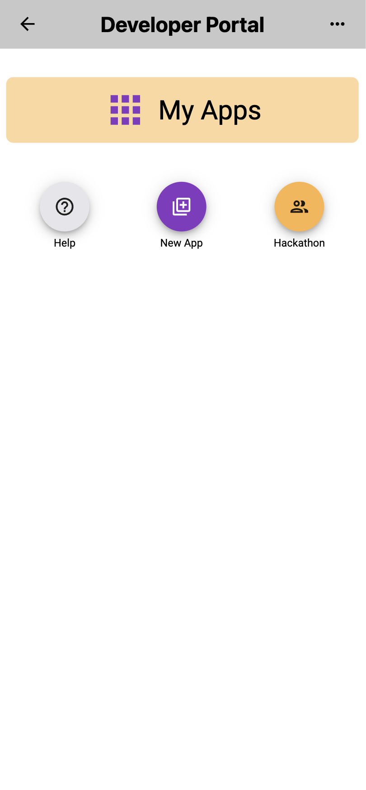
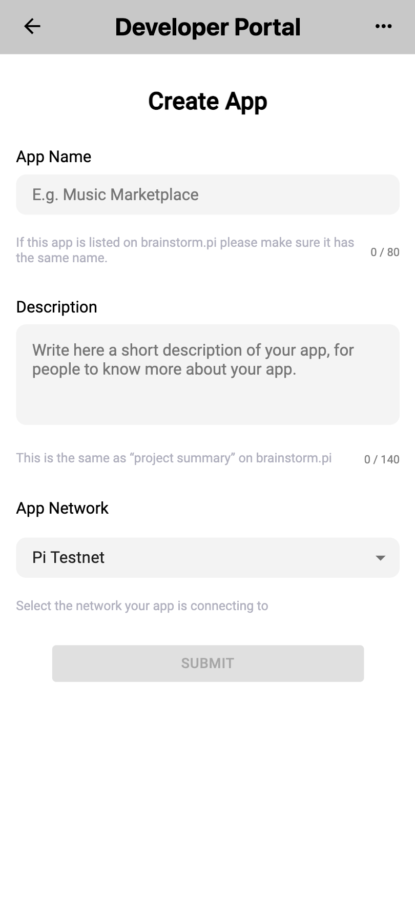
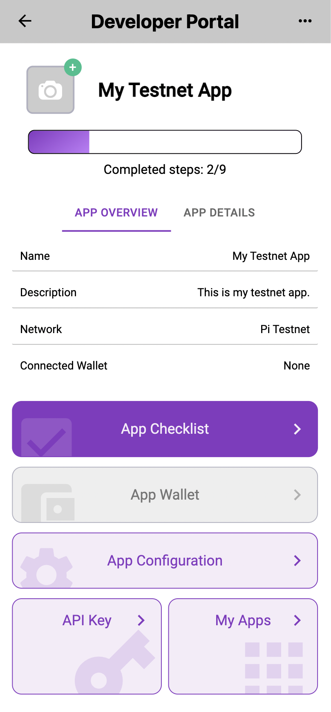
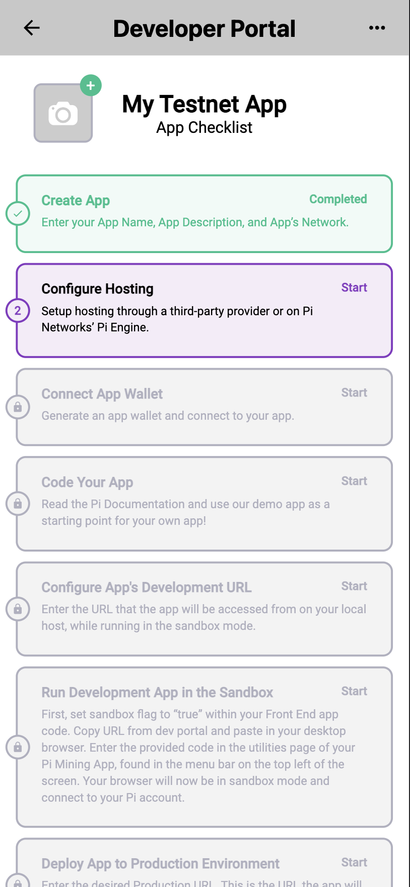
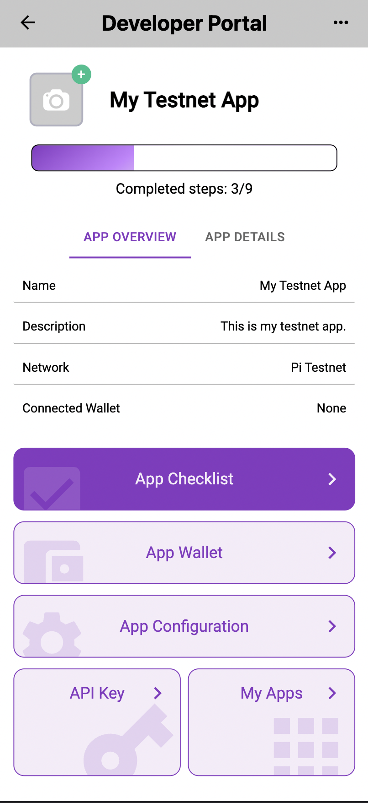
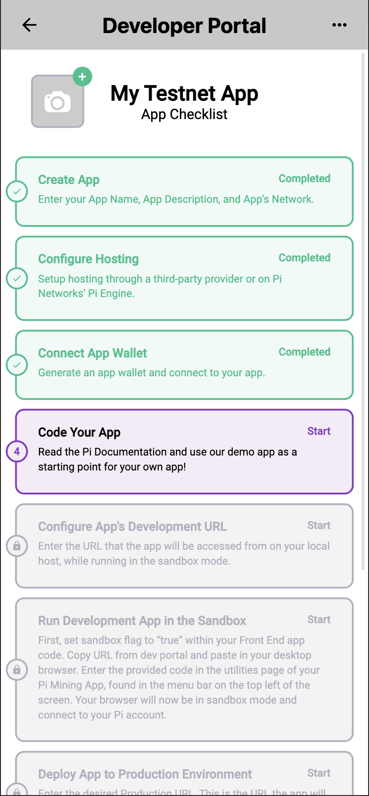

# Pi Developer Portal

With the help of Pi SDK and Pi API, you can create applications that run within the Pi browser, which can be used by other Pioneers. Pi Developer Portal is where you can register and configure your apps so that it can be connected to the Pi Blockchain.

## How to register your app

1. The Pi Developer Portal can be accessed using the Pi Browser. Go to `pi://develop.pi` to visit the Pi Developer Portal. When you first get to the main page, you won't see any app. To register your app, tab on the "New App" button.

  

 

2. Initially you're asked to fill in 3 required fields. The "App Network" option lets you select the host network that your app is connecting to. Depending on this option, Pi SDK will automatically connect your app to the corresponding network, either to Pi Mainnet or Pi Testnet. Note that an app can only connect to one network at a time, and once you register the app, this option cannot be changed. What this means is you're advised to create two different apps, one with testnet for testing purpose and one with mainnet for your production usage.

  

 

3. After you register your app, you can see your app in detail. Each app has its own "App Checklist", which helps you keep track of required steps to successfully set up your app. To see the checklist, tab on "App Checklist" button.

  

 

4. The checklist steps will be unlocked sequentially as you complete each step. The first step is to configure the hosting option.

  

 

5. Once you configure the hosting option, you'll see that "App Wallet" button is now enabled, and the next step for checklist is connecting a wallet to the app. Follow the instruction to create the app and connect it to your app.

  

 

6. When you connect your app wallet to your app, the checklist will show you documentations that you can go over to get started. From here, you can have a look and follow the remaining steps to fully configure the app.

  

 

## Testnet app in the Pi Browser

If you registered your app to connect to the Pi Testnet and if you visit your app in the Pi Browser, it will show the black and yellow stripe at the top to indicate that this app is connected to the Pi Testnet.

    

## Legacy Project created before 26/07/2022

Projects that existed prior to the launch of the Pi Mainnet SDK will point to the Pi Testnet

- This cannot be changed or updated
- It is best practice to create new Developer Portal Projects

### Developers and Teams with previously created Legacy Projects

1. Create a new Developer Portal Project
   - Select Mainnet - This will be the Mainnet Version of the App
   - URL
     - This project should contain the desired URL that Pioneers will access the app with through the Pi Browser
     - URL ownership will be determined through verification process
   - Payment Wallet
     - Until developer/app wallets are created the wallet address of the developer who creates the new project page will be used to process all transactions
     - If the project page creator does not have a Pi Wallet Address which has been created in a Mainnet Migration all transactions will fail.
2. Create a second new Developer Project Page
   - Select Testnet - This will be for testing purposes
   - URL
     - Cannot be the same as the Mainnet URL
     - Must be owned by the developer as well
   - Set the desired access permissions
   - This project can be linked to the previously created Mainnet Project from step 1
3. Link Mainnet Project to the Brainstorm project (if applicable)
   - As of July 2022 it is possible to link only one developer portal project to a brainstorm project

### Special Considerations

- If an app team has no members with a Mainnet Wallet
  - Please reach out to the Pi CT through the <a href="https://pinetwork.atlassian.net/servicedesk/customer/portal/1/group/3/create/20" target="_blank">Pi Support Portal</a>
  - For the question “What does your question relate to? ”
    - Select “Pi Mainnet SDK Wallet”
    - Submit contact information
    - A member of the Pi CT will follow up
