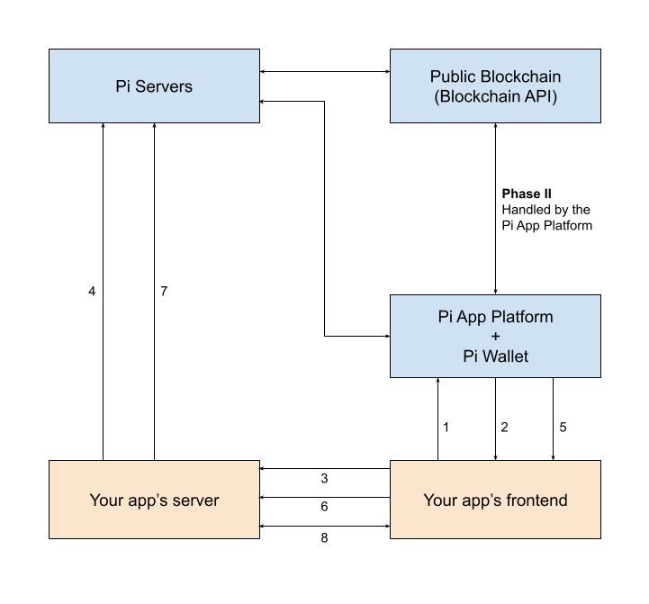

# Payments

Payments are wrappers around blockchain transactions, which enable your app,
the Pi blockchain, and the Pi Servers to be all synchronized when the user 
submits a blockchain transaction to pay for something in your app.

They enable you, the developer of the app, to have full confidence that the
user has actually made the transaction, while not having to
bother with the technicalities involved when interacting with the Pi blockchain.

## The Payment flow

After they're created, payments go through 3 major phases:

1. Payment creation and Server-Side Approval
2. User interaction and blockchain transaction
3. Server-Side Completion

**Phase I - Payment creation and Server-Side Approval**

1. `createPayment`: Your app's frontend creates the payment. The Payment Flow UI opens, but cannot be interacted with until the payment is approved by your server.

2. `onReadyForServerApproval`: The JS SDK has obtained the payment identifier (PaymentID) and is passing it to your app for Server-Side approval.

3. Your app's frontend sends the PaymentID to your app's server. This implementation is your responsibility.

4. Server-Side Approval: Your app's server approves the payment with Pi Servers through the `/approve` API call. This enables the user to submit the blockchain transaction.

**Phase II - User interaction and blockchain transaction**

At this stage, the payment dialog becomes interactive and enables the
user to confirm the transaction, sign it, and submit it to the Pi blockchain.

You do not have anything to do at this stage, everything is handled by the Pi
Apps Platform and the Pi Wallet.

After the blockchain transaction is submitted, the payment flow will not close.
You need to acknowledge the payment through Server-Side completion before your
app is visible again.

**Phase III - Server-Side Completion**

5. `onReadyForServerCompletion`: The JS SDK passes the blockchain transaction identifier (TxID) to your app's frontend. You need this value for the Server-Side Completion flow.

6. Your app's frontend sends the TxID to your app's server. This implementation is your responsibility.

7. Server-Side Completion: Your app's server acknowledges the payment with Pi Servers through the `/complete` API call. This enables you to check whether the blockchain transaction has actually happened, and to let Pi know that
you're aware of it.

8. The payment flow closes. Your app is now visible to the user again.
Your app's server and your app's frontend can exchange data, and
update the app interface to show a confirmation screen to the user.
This implementation is your responsibility.

> **The user might be lying to your app!**
>
> Users might be running a hacked version of the SDK, pretending that they
> have made a payment. If the API call for Server-Side completion
> returns a non-200 error code, **do not** mark the payment as complete on your
> side, and **do not** deliver whatever the user was trying to buy.
