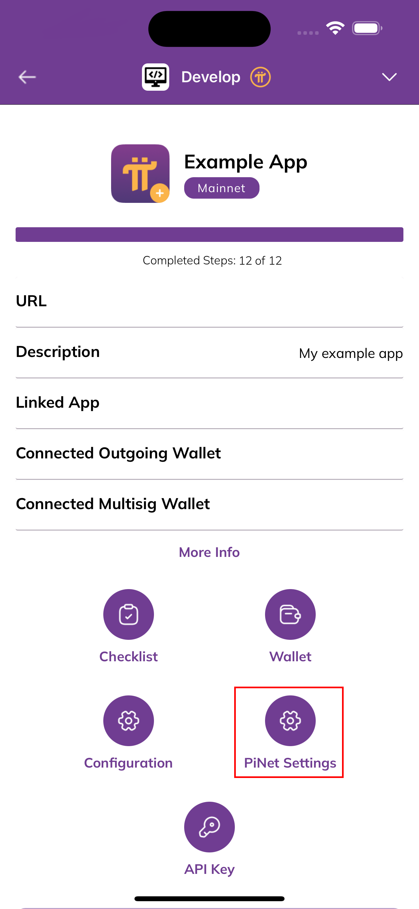

# PiNet Metadata

## Table of contents

- [Overview](#overview)
- [Frontend Metadata Support](#frontend-metadata-support)
- [Backend Metadata Support](#backend-metadata-support)
  - [Prerequisites](#prerequisites)
  - [Backend Setup](#backend-setup)
  - [Types](#types)
    - [`PiNetMetadataDTO`](#pinetmetadatadto)
    - [OpenGraph](#opengraph)
    - [Twitter Cards](#twitter-cards)
  - [`PiNetMetadataDTO` Validation Tool](#pinetmetadatadto-validation-tool)

## Overview

PiNet provides support for exposing metadata tags on behalf of your application. The most practical use of this feature is proxying HTML meta tags responsible for Facebook Open Graph and Twitter Cards thumbnails which can further increase your app recognition and growth.


As of now there are two ways in which you can make use of the feature, which further down this documentation we'll refer to as **`frontend`** and **`backend`** flows.

## Frontend Metadata Support

The **`frontend`** metadata support option is default for all apps registered on PiNet. It involves PiNet scraping data from your application's frontend in a similar way bots do and then exposing it on your behalf. As a developer you simply need to take care of exposing proper meta tags from your HTML files without worrying about how PiNet would then scrape them. A useful tool for validating your HTML files is [metatags.io](https://metatags.io). If the meta tags you're interested in exposing are present there, they should be automatically picked up by PiNet as well if the **`frontend`** flow is selected.

The **`frontend`** metadata support is a relevant option for developers who:

a. are interested in exposing single set of metadata for whole app,
b. are interested in exposing dynamic metadata per page while developing a SSR app.

## Backend Metadata Support

The `frontend` flow, despite how simple it is and how little custom configuration it requires from developers who make use of web and SSR frameworks, may be inconvenient to use for Single Page Application developers. Therefore PiNet also exposes a custom solution which involves **`backend`** communication between PiNet and your application so that if you're developing Single Page Application you can have your pages generate metadata tags dynamically.

## Prerequisites

Before using **`backend`** metadata support option, first it must be selected in Pi Developer Portal app. Go to Pi Developer Portal application, select the application you want to enable `backend` PiNet metadata support for, and go to "PiNet Settings". There, select `backend` option for **Metadata Support Type** field and provide valid backend URL.

**Note:** before configuring PiNet settings, the app must have a validated domain registered in the Pi Developer Portal.




## Backend Setup

When **`backend`** metadata support type is selected, PiNet sends GET requests to your backend endpoint at `/pinet/meta?pathname=<encoded-pathname>` passing the pathname of the url as search param.
E.g. for PiNet application with PiNet subdomain `example` (available at `https://example.pinet.com`), when `https://example.pinet.com/faq/1` URL is used, PiNet would send GET request to `https://examplebackendurl.com/pinet/meta?pathname=%2Ffaq%2F1'` and expect it to respond with a DTO of `PiNetMetadataDTO` shape. If the response is of HTTP status code 200 and of proper shape, PiNet will expose the metadata outside.

### Types

#### `PiNetMetadataDTO`

PiNet expects you to respond with `PiNetMetadataDTO` type. All of the fields at the top level of the DTO are optional so if you don't feel like providing all of the metadata details, you don't need to. However, some of the nested types if provided, require you to provide corresponding mandatory fields.

In the type aliasses definitions below, all fields that contain a `?` immediately after the key indicate an optional field. Ex. `title?:` indicates an optional field while `title:` would be a required field.

```typescript
type PiNetMetadataDTO = {
  title?: string;
  description?: string;
  authors?: null | Author | Array<Author>;
  keywords?: null | string | Array<string>;
  creator?: null | string;
  publisher?: null | string;
  formatDetection?: null | FormatDetection;
  abstract?: null | string;
  archives?: null | string | Array<string>;
  category?: null | string;
  classification?: null | string;
  openGraph?: null | OGMetadata;
  twitter?: null | TwitterMetadata;
  icons?: null | string | Array<Icon> | Icons;
};
```

Below are listed the type aliases specific to default HTML meta tags, used in the `PiNetMetadataDTO` above:

```typescript
type Author = {
  url?: string;
  name?: string;
};

type FormatDetection = {
  telephone?: boolean;
  date?: boolean;
  address?: boolean;
  email?: boolean;
  url?: boolean;
};

type IconDescriptor = {
  url: string;
  type?: string;
  sizes?: string;
  color?: string;
  rel?: string;
  media?: string;
  fetchPriority?: "high" | "low" | "auto";
};

type Icon = string | IconDescriptor;

type Icons = {
  icon?: Icon | Array<Icon>;
  shortcut?: Icon | Array<Icon>;
  apple?: Icon | Array<Icon>;
  other?: IconDescriptor | Array<IconDescriptor>;
};
```

#### OpenGraph

PiNet allows you to define OpenGraph specific metadata, which will be exposed on your behalf. The main `OGMetadata` type alias is a discriminated union, where the `type` field is the discriminant. Therefore some of the `OGMetadata` union members allow you to specify additional properties if the specific `type` is defined.

```typescript
type OGMetadata =
  | OGMetadataWebsite
  | OGMetadataArticle
  | OGMetadataBook
  | OGMetadataProfile
  | OGMetadataMusicSong
  | OGMetadataMusicAlbum
  | OGMetadataMusicPlaylist
  | OGMetadataMusicRadioStation
  | OGMetadataVideoMovie
  | OGMetadataVideoEpisode
  | OGMetadataVideoTVShow
  | OGMetadataVideoOther;

type OGMetadataBase = {
  title?: string;
  description?: string;
  emails?: Array<string>;
  phoneNumbers?: Array<string>;
  faxNumbers?: Array<string>;
  locale?: string;
  alternateLocale?: Array<string>;
  images?: OGImage | Array<OGImage>;
  audio?: Array<OGAudio>;
  videos?: Array<OGVideo>;
  countryName?: string;
};

type OGMetadataWebsite = OGMetadataBase & {
  type: "website";
};

type OGMetadataArticle = OGMetadataBase & {
  type: "article";
  publishedTime?: string;
  modifiedTime?: string;
  expirationTime?: string;
  authors?: null | string | Array<string>;
  section?: null | string;
  tags?: null | string | Array<string>;
};

type OGMetadataBook = OGMetadataBase & {
  type: "book";
  isbn?: null | string;
  releaseDate?: null | string;
  authors?: null | string | Array<string>;
};

type OGMetadataProfile = OGMetadataBase & {
  type: "profile";
  firstName?: null | string;
  lastName?: null | string;
  username?: null | string;
  gender?: null | string;
};

type OGMetadataMusicSong = OGMetadataBase & {
  type: "music.song";
  duration?: null | number;
  albums?: null | string | OGAlbum | Array<OGAlbum>;
  musicians?: null | string | Array<string>;
};

type OGMetadataMusicAlbum = OGMetadataBase & {
  type: "music.album";
  songs?: null | string | OGSong | Array<string | OGSong>;
  musicians?: null | string | Array<string>;
  releaseDate?: null | string;
};

type OGMetadataMusicPlaylist = OGMetadataBase & {
  type: "music.playlist";
  songs?: null | string | OGSong | Array<string | OGSong>;
  creators?: null | string | Array<string>;
};

type OGMetadataMusicRadioStation = OGMetadataBase & {
  type: "music.radio_station";
  creators?: null | string | Array<string>;
};

type OGMetadataVideoMovie = OGMetadataBase & {
  type: "video.movie";
  actors?: null | string | OGActor | Array<OGActor>;
  directors?: null | string | Array<string>;
  writers?: null | string | Array<string>;
  duration?: null | number;
  releaseDate?: null | string;
  tags?: null | string | Array<string>;
};

type OGMetadataVideoEpisode = OGMetadataBase & {
  type: "video.episode";
  actors?: null | string | OGActor | Array<OGActor>;
  directors?: null | string | Array<string>;
  writers?: null | string | Array<string>;
  duration?: null | number;
  releaseDate?: null | string;
  tags?: null | string | Array<string>;
  series?: null | string;
};

type OGMetadataVideoTVShow = OGMetadataBase & {
  type: "video.tv_show";
};

type OGMetadataVideoOther = OGMetadataBase & {
  type: "video.other";
};
```

Below are listed the type aliases reused across different `OGMetadata` union members above:

```typescript
type OGImageDescriptor = {
  url: string;
  secureUrl?: string;
  alt?: string;
  type?: string;
  width?: string | number;
  height?: string | number;
};

type OGImage = string | OGImageDescriptor;

type OGVideoDescriptor = {
  url: string;
  secureUrl?: string;
  alt?: string;
  type?: string;
  width?: string | number;
  height?: string | number;
};

type OGVideo = string | OGVideoDescriptor;

type OGAudioDescriptor = {
  url: string;
  secureUrl?: string;
  alt?: string;
};

type OGAudio = string | OGAudioDescriptor;

type OGActor = {
  url: string;
  role?: string;
};

type OGSong = {
  url: string;
  disc?: number;
  track?: number;
};

type OGAlbum = {
  url: string;
  disc?: number;
  track?: number;
};
```

#### Twitter Cards

Similarly to providing support for OpenGraph protocol, PiNet allows you to define Twitter specific metadata. The main `OGTwitterMetadata` type alias is a discriminated union, where the `card` field is the discriminant. Therefore some of the `OGTwitterMetadata` union members allow you to specify additional properties if the specific `card` is defined.

```typescript
type TwitterMetadata =
  | TwitterMetadataBase
  | TwitterMetadataCardSummary
  | TwitterMetadataCardSummaryLargeImage
  | TwitterMetadataCardPlayer
  | TwitterMetadataCardApp;

type TwitterMetadataBase = {
  title?: string;
  description?: string;
  creator?: string;
  creatorId?: string;
  images?: TwitterImage | Array<TwitterImage>;
};

type TwitterMetadataCardSummary = TwitterMetadataBase & {
  card: "summary";
};

type TwitterMetadataCardSummaryLargeImage = TwitterMetadataBase & {
  card: "summary_large_image";
};

type TwitterMetadataCardPlayer = TwitterMetadataBase & {
  card: "player";
  players: TwitterPlayerDescriptor | Array<TwitterPlayerDescriptor>;
};

type TwitterMetadataCardApp = TwitterMetadataBase & {
  card: "app";
};
```

Below are listed the type aliases reused across different `OGTwitterMetadata` union members above:

```typescript
type TwitterImageDescriptor = {
  url: string;
  secureUrl?: string;
  alt?: string;
  type?: string;
  width?: string | number;
  height?: string | number;
};

type TwitterImage = string | TwitterImageDescriptor;

type TwitterPlayerDescriptor = {
  url: string;
  width: number;
  height: number;
};
```

### `PiNetMetadataDTO` Validation Tool

The `PiNetMetadataDTO` can get quite complex and it may be difficult for you to verify if the DTO you respond with would pass PiNet internal validation. You can use form available on [PiNet](https://pinet.com/developer/metadata) to validate if your DTO is valid.
